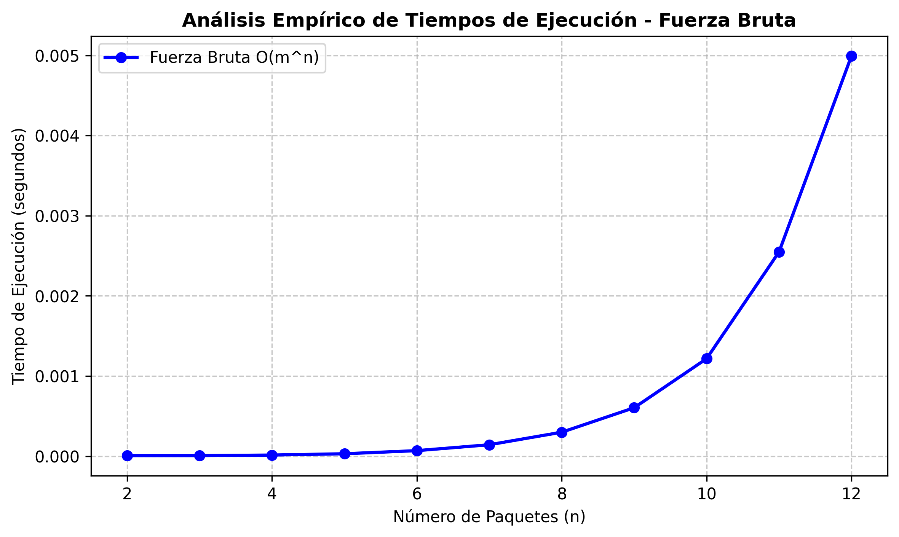

# Caso de Estudio: Optimización Logística (Sistema de Logística y Entregas)

> ## Objetivo de la Solución de Fuerza Bruta
> 
> Generar exhaustivamente todas las posibles asignaciones de paquetes a camiones, evaluar las secuencias de entrega y verificar qué combinaciones respetan las capacidades máximas de carga de los camiones, así como las ventanas de horario permitidas de cada cliente, devolviendo las soluciones válidas.

---

> ## 1. Descripción del Conjunto de Datos y Casos de Prueba
> 
> Para la validación y pruebas del algoritmo de asignación y ruteo logístico de paquetes a camiones, se estructuraron tres casos de prueba en formato TXT ubicados en la carpeta `datos/`: `caso_pequeno.txt`, `caso_mediano.txt` y `caso_grande.txt`.
> 
> Cada archivo contempla la capacidad física y hora de salida de la flota de camiones, así como los pesos, destinos, tiempos de traslado y ventanas de horario para la entrega de cada paquete (cubriendo la asignación, ruteo y restricciones de tiempo).
> 
> Ejemplo de la estructura de datos utilizada (`datos/caso_grande.txt`):
> 
> ```json
> {
>   "camiones": [
>     {
>       "id": "C1",
>       "capacidad": 30,
>       "hora_inicio": 8
>     },
>     {
>       "id": "C2",
>       "capacidad": 25,
>       "hora_inicio": 8
>     },
>     {
>       "id": "C3",
>       "capacidad": 20,
>       "hora_inicio": 8
>     },
>     {
>       "id": "C4",
>       "capacidad": 30,
>       "hora_inicio": 8
>     }
>   ],
>   "paquetes": [
>     {
>       "id": "P1",
>       "peso": 7,
>       "destino": "D1",
>       "ventana_inicio": 9,
>       "ventana_fin": 11,
>       "tiempo_viaje": 1,
>       "tiempo_entrega": 1
>     },
>     {
>       "id": "P2",
>       "peso": 12,
>       "destino": "D2",
>       "ventana_inicio": 10,
>       "ventana_fin": 12,
>       "tiempo_viaje": 1,
>       "tiempo_entrega": 1
>     },
>     {
>       "id": "P3",
>       "peso": 5,
>       "destino": "D3",
>       "ventana_inicio": 11,
>       "ventana_fin": 13,
>       "tiempo_viaje": 2,
>       "tiempo_entrega": 1
>     },
>     {
>       "id": "P4",
>       "peso": 9,
>       "destino": "D4",s
>       "ventana_inicio": 12,
>       "ventana_fin": 14,
>       "tiempo_viaje": 2,
>       "tiempo_entrega": 1
>     },
>     {
>       "id": "P5",
>       "peso": 15,
>       "destino": "D1",
>       "ventana_inicio": 9,
>       "ventana_fin": 11,
>       "tiempo_viaje": 1,
>       "tiempo_entrega": 1
>     },
>     {
>       "id": "P6",
>       "peso": 3,
>       "destino": "D2",
>       "ventana_inicio": 10,
>       "ventana_fin": 12,
>       "tiempo_viaje": 1,
>       "tiempo_entrega": 1
>     },
>     {
>       "id": "P7",
>       "peso": 8,
>       "destino": "D3",
>       "ventana_inicio": 11,
>       "ventana_fin": 13,
>       "tiempo_viaje": 2,
>       "tiempo_entrega": 1
>     },
>     {
>       "id": "P8",
>       "peso": 10,
>       "destino": "D4",
>       "ventana_inicio": 12,
>       "ventana_fin": 14,
>       "tiempo_viaje": 2,
>       "tiempo_entrega": 1
>     },
>     {
>       "id": "P9",
>       "peso": 6,
>       "destino": "D1",
>       "ventana_inicio": 9,
>       "ventana_fin": 11,
>       "tiempo_viaje": 1,
>       "tiempo_entrega": 1
>     },
>     {
>       "id": "P10",
>       "peso": 11,
>       "destino": "D2",
>       "ventana_inicio": 10,
>       "ventana_fin": 12,
>       "tiempo_viaje": 1,
>       "tiempo_entrega": 1
>     },
>     {
>       "id": "P11",
>       "peso": 4,
>       "destino": "D3",
>       "ventana_inicio": 11,
>       "ventana_fin": 13,
>       "tiempo_viaje": 2,
>       "tiempo_entrega": 1
>     },
>     {
>       "id": "P12",
>       "peso": 14,
>       "destino": "D4",
>       "ventana_inicio": 12,
>       "ventana_fin": 14,
>       "tiempo_viaje": 2,
>       "tiempo_entrega": 1
>     }
>   ]
> }
> ```

---

> ## 2. Instrucciones de Ejecución
> 
> Para ejecutar la medición empírica de tiempos de ejecución y actualizar la gráfica de Fuerza Bruta, ejecuta el siguiente comando desde la raíz del proyecto:
> 
> ```bash
> python3 src/comparativa.py
> ```

---

> ## 3. Análisis de Complejidad Teórica
> 
> * **Complejidad en Tiempo: Exponencial — O(m^n · n)**  
>   Si tenemos **n paquetes** y **m camiones**, el algoritmo prueba **m^n** combinaciones distintas para repartir los paquetes. Además, en cada intento revisa la lista completa de paquetes para validar el peso y el horario, sumando un costo adicional proporcional a **n**. Esto hace que el tiempo de ejecución explote y se vuelva extremadamente lento al aumentar los paquetes.
> 
> * **Complejidad en Memoria (Espacio): O(n²)**  
>   A medida que el programa explora las opciones de manera recursiva, guarda en la memoria una copia de las asignaciones de cada nivel. Al llegar a una profundidad máxima de **n** niveles guardando información de hasta **n** paquetes, el consumo total de memoria crece de forma cuadrática.

---

> ## 4. Análisis Empírico de Tiempos de Ejecución
> 
> Se realizó una medición experimental de tiempos de ejecución variando la cantidad de paquetes (n) desde n = 2 hasta n = 12.
> 
> 
> 
> Como se observa en la gráfica, el tiempo transcurrido aumenta de forma vertiginosa a medida que crece n. Esto confirma empíricamente la complejidad teórica del algoritmo de Fuerza Bruta (O(m^n · n)), demostrando que el tiempo de procesamiento se vuelve inviable para instancias grandes de paquetes.